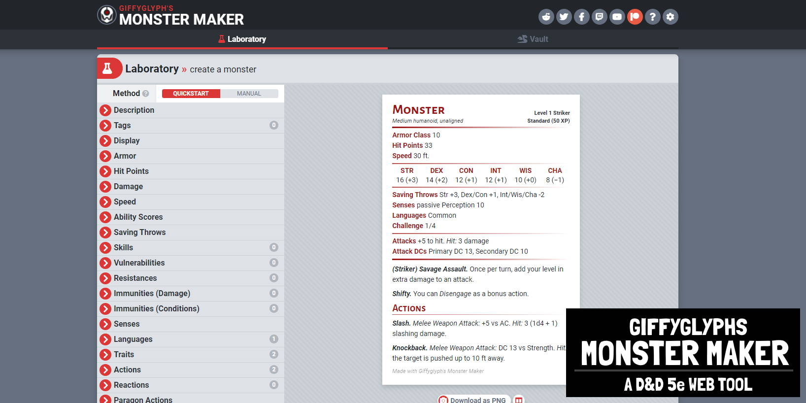

# Перевод на русский Giffyglyph's 5e Monster Maker Webapp

## Features

* Swap out Challenge Ratings (CR) for easy-to-track **Monster Levels (ML)**.
* Build monsters of any level with simplified **Monster Stats**.
* Give your monsters some identity in combat with **Monster Roles**.
* Add simple **Traits & Powers** to create interesting variety in your combat.
* Save monsters in your own local **Monster Vault**.
* Export monsters to PNG, JPG, JSON, Improved Initiative, and GMBinder.
* Usable on any desktop, tablet, and mobile device.

## Roadmap

## Support

## Licensing

This work is licensed under a [Creative Commons Attribution-NonCommercial-ShareAlike 4.0 International License](http://creativecommons.org/licenses/by-nc-sa/4.0/).
